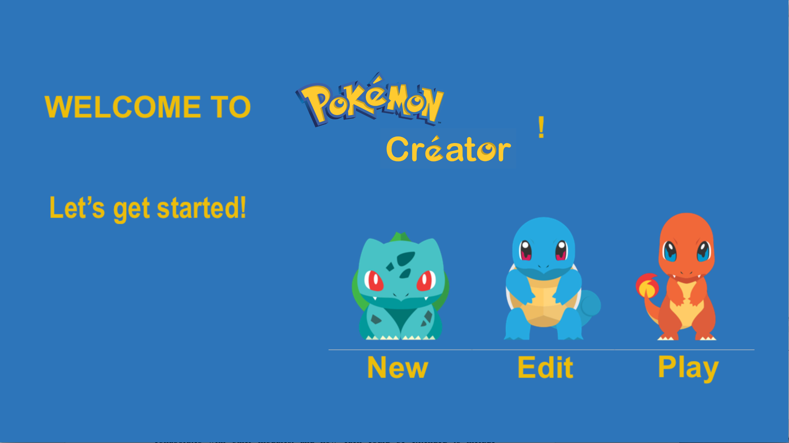
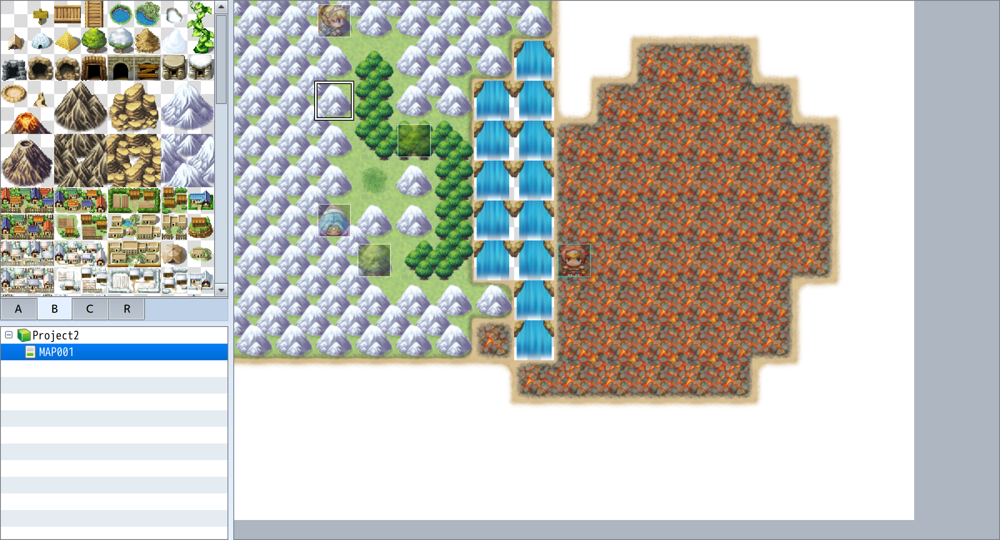

## Introduction

Our team aims to develop an engine that can be used to several other Role Playing Game (RPG). The most flexible part is the selection of different parameters for players, map and items. The closed part is the winning condition of each fight, but all the other parts are kept open. The unique quality of RPG is that the scene is kept changing and evolving and the characters/pokemons have different attributes. Our design is that the users are allowed to set all those settings before they start the game. Those information is passed to an xml file. When the user actually starts the game, the information in xml file will be read back.  

## Overview

We divide the game into back end, front end and data. In the front end, a part is to handle Menu and general UI. Another part is to handle the battle scene. The third part is related to map and player movement. We made such division because those parts are relatively independent. UI will be linked to map by putting the map on a particular place of scene. Player will be put on the map. The battle scene will only be loaded when the player encounters a pokemon/trainer. In the back end, we have map, player model, battle, pokemon and items. Map and battle in the back end will correspond to the map and battle in the front end.   

## User Interface

The user component: At the beginning, there is a splash screen which provides the following choices: To create a new game, To edit an existing game, and To play a saved/edited game.
	

	
(like the above splash screen)

When playing the game, it should have the similar appearance as the original pokemon game, which is like:

When editing the game, it should enable users to toggle the tiles into grids to create a map.

(like this, just ignore the left-bottom file tree for now)

Also, after the user has edited the map, he can create events on the map: the events include triggering a battle, a dialogue or other things. At the same time, there should also be “+” button on the left side of the screen, which is a button to let user to import his own data configuration into the database--- like a new kind of image, or new type of pokemon.

Finally, after the user has only added images to the events, the user can customize what he wants the event exactly to do in the third scene of editing. He can add what should be triggered of a certain event in the third scene.

The error detection: for every exception, the front-end should catch the exception and show the message conveyed by the exception as a dialogue box in the stage.

## Design Details

Within our game authoring program there are two environments. One environment allows users to implement their customizations in order to ‘create’ the game and another is where the user can play in their created world. In our creation mode we offer the ability to edit the map by dragging and dropping of certain objects and tiles, this created map can then be used in the main game engine as the player environment. This therefore relies on being able to store the data as an XML using our save data API but also have the appropriate class(es) to be able to reconstruct the map and make it active i.e. enable collisions between obstacles on the map or set pokemon to appear at specific tiles. Also in the creation environment the user can set attributes of the character including name, player image, starting items, starting pokemon and starting currency. Already here we can see that other modules may be needed in order to introduce the features for starting items and pokemon, which we will come onto next. For the player however we need to be able to store these chosen values in an XML file again using our save data API and have the appropriate Player module set up in the game engine to store these values appropriately and contain methods so that they can be applied in game. For the player to be able to store items and pokemon as mentioned we need to have the appropriate Items and Pokemon modules setup that provide the ability to create instances of a new item/pokemon and store their specific attributes to be used elsewhere in the program and access specific values such as image file paths from a properties file. These modules can also be customized in the creation environment e.g. selecting what items are available and their quantitative properties and changing pokemon names or adding your own pokemon to the game. This information can be stored appropriately in an XML file and used in the main game engine where we utilize the modules previously described.
	
	
Moving on from the creation mode there is also a few design components specific to the playable game engine mode one major one being the Pokemon battle. For a battle to work it needs access to Items available to the player and their associated abilities and the pokemon that belong to the user and their attributes and attacks. We can then form a design to simulate the turn based combat using this information and work with front end to create a user interface that allows for user input which is sent to the back end. As an extension we hope to implement creating smarter AI in order to increase difficulty in the game - rather than just through increased enemy stats - which may require the introduction of an Enemy module which is somewhat similar and may extend our player module in some ways but can implement algorithms to make the battles harder and more interesting.
	
As an overarching feature in our game we need a continual progression which we’ve chosen to be through currency, experience and pokemon upgrades mainly. Some of these may be part of our extension e.g. introduction of a shop, so our modules should be made in order to allow for this progression e.g. the Pokemon module should include methods that allow for the upgrade of attributes and even ‘evolution’.

## Example games
Pokemon

- it's absolutely supported

Risk boardgame type game

- make the NPC be the ruler of determining who takes what kind of step

Dragon Quest

- change pokemon into other different types of monster, such as slime.

## Design Considerations
One issue that was discussed during our planning process was the way in which we would be saving things to xml files. The choices that were presented were to either have one xml type that was universally used, or to use two different types of files to represent differences in creating games and saving games. The place where this becomes an issue is the fact that we would either decide to create objects when creating the game, or we would pass incomplete information that would later be used to create the objects when the game was run. The route that would not create objects in the game developer would necessitate two types of xml files, and the main problem with this is the fact that parsing and writing these two files would require different methods as they would be passed different things: incomplete information from the developer and objects from the game. 

Therefore, we decided to go with the one xml file type, but there is a drawback from a design standpoint as this now requires that we create objects when we are creating the game, instead of creating the objects when the game is launched. We are still not completely set on this design, but there will eventually be conflicts from this as the game creator will be dependent upon whether or not it actually creates objects and the xml parser will be dependent upon the type of information passed to it. The only remaining problem is to either confirm our design, or go the other way and clear any ambiguities by defining the information that the game creator stores, if this is not stored in game objects. 
